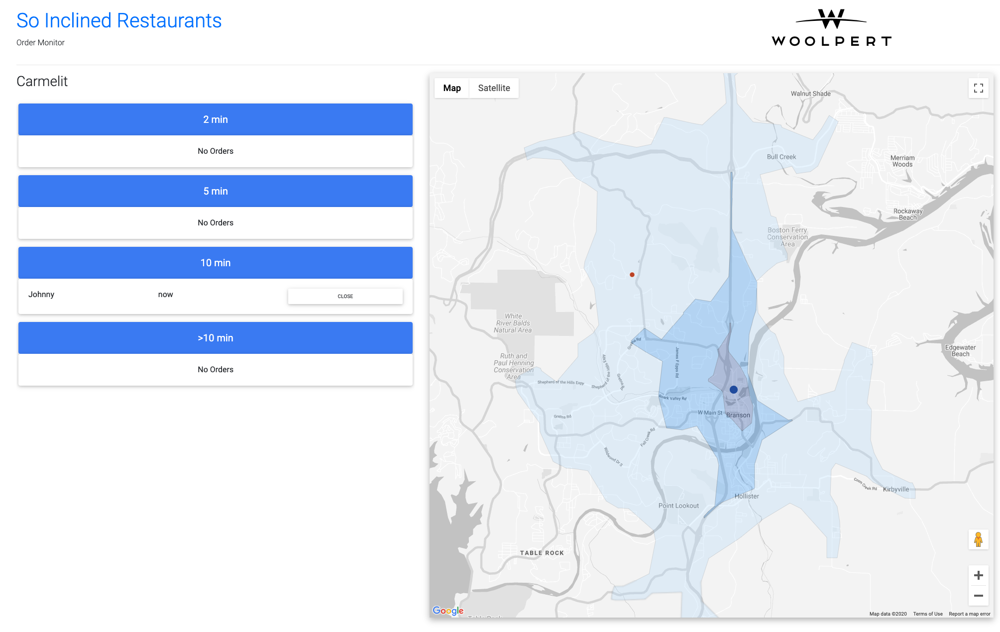
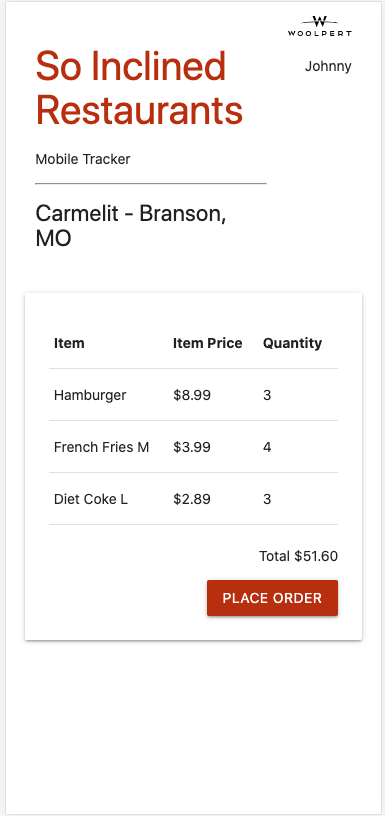
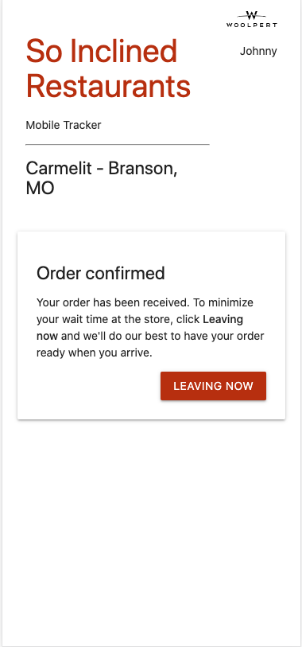
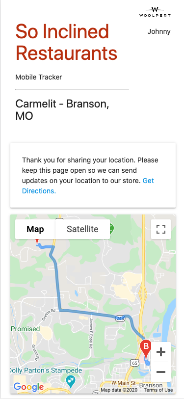
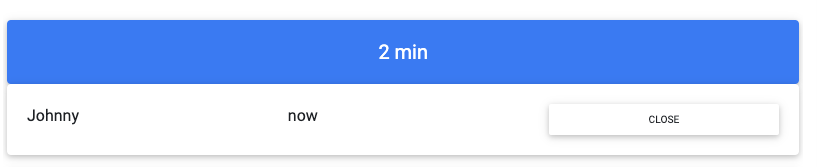
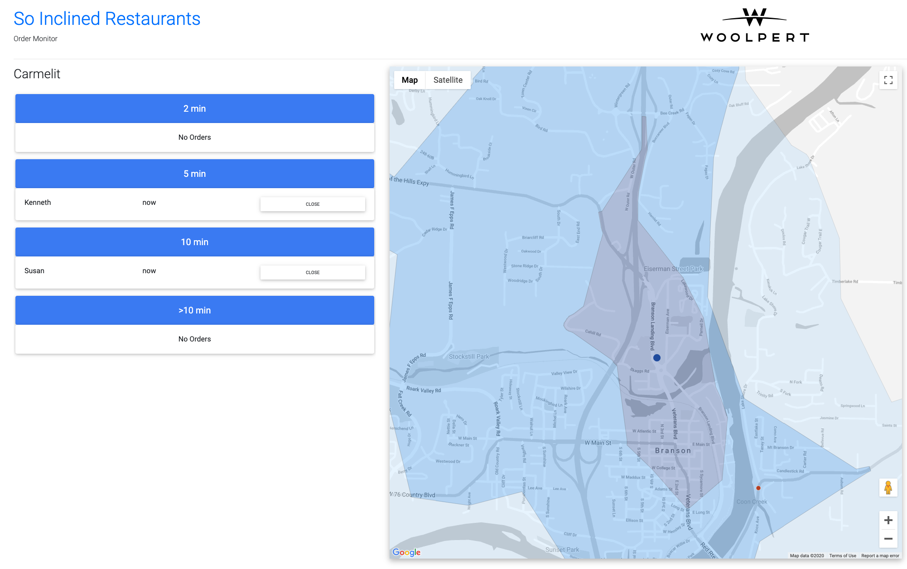

# GeoAwareness Runbook

The GeoAwareness system consists of four primary components. Here is a description of each.

- [Geofencing service](https://gitlab.com/woolpert/cloud/demos/geoawareness/geoawareness-geofencing)

  - Listens for telemetry event messages in the geoawareness-ingest Pub/Sub topic.
  - Intersects events against geofence polygons stored in Datastore.
  - Writes the results to Order and Event documents in Datastore.

- [REST API](https://gitlab.com/woolpert/cloud/demos/geoawareness/geoawareness-api) - Provides access to the Geoawareness data model and telemetry event ingest services.

- [Order Monitor](https://gitlab.com/woolpert/cloud/demos/geoawareness/geoawareness-order-monitor) - Website consisting of a near real-time dashboard of customer locations along with their ETAs. The dashboard includes both a map and order queue.

- [Mobile Tracker](https://gitlab.com/woolpert/cloud/demos/geoawareness/geoawareness-mobile-tracker) - Mobile website that emulates the customer experience for placing an order and tracking location as the customer progresses towards the store.

The Geofencing service and REST API are backend components while Order Monitor and Mobile Tracker are frontend components. Both frontend components are example integrations. Each component resides in its own repository.

---

## Deploy to GCP

All components will be deployed into a single Google Cloud Project.

### Foundational

Decide on a project id, region, and zone.

```
export PROJECT_ID=<YOUR_PROJECT_ID>

# Create new cloud project
gcloud projects create $PROJECT_ID

# Create new cloud project within GCP folder (optional)
# If you have a Google Cloud Organization and policy requires you to create a project within a specific folder.
gcloud projects create $PROJECT_ID --folder=<YOUR_FOLDER_ID>

# Configure gcloud shell environment
gcloud config set project $PROJECT_ID

export GCP_REGION=<YOUR_GCP_REGION>
gcloud config set compute/region $GCP_REGION

export GCP_ZONE=<YOUR_GCP_ZONE>
gcloud config set compute/zone $GCP_ZONE
```

### Deploy components

Follow the instructions provided in the individual READMEs included with each repository. We recommend standing up each component in the following order:

1. [Geofencing service](https://gitlab.com/woolpert/cloud/demos/geoawareness/geoawareness-geofencing)
   - be sure the smoke test passes before proceeding
1. [REST API](https://gitlab.com/woolpert/cloud/demos/geoawareness/geoawareness-api)
1. [Order Monitor](https://gitlab.com/woolpert/cloud/demos/geoawareness/geoawareness-order-monitor)
1. [Mobile Tracker](https://gitlab.com/woolpert/cloud/demos/geoawareness/geoawareness-mobile-tracker)

## Run the Demo

1. Open **Order Monitor** and click on the _Carmelit_ store to view the near real-time dashboard.

   </img>

1. Open **Mobile Tracker**. Click _Place Order_ followed by _Leaving Now_. Take note of the fictitious customer’s name in the top right corner.

   

   

   

1. In **Order Monitor**, watch the order queue (left) and map (right) as the customer’s order appears in the dashboard. Zoom in to a geofence by clicking the drive-time group heading in the order queue.

1. Open a few more instances of **Mobile Tracker** in your browser (new tabs) or on your mobile device(s). Place some more orders and don’t forget to click _Leaving Now_.

1. In **Order Monitor**, spend some time watching the location updates on the map. As a customer crosses a geofence boundary, the order changes drive-time groups in the order queue.

1. Click _Close_ on a customer order. The order disappears from the queue and map.

   </img>

   </img>
